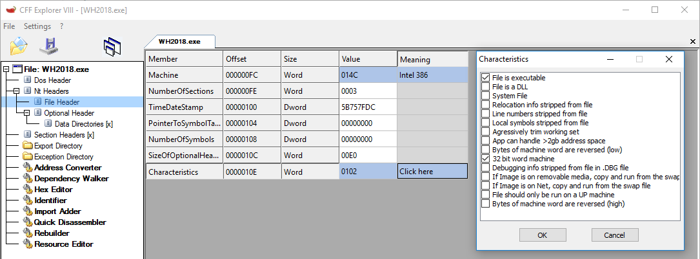
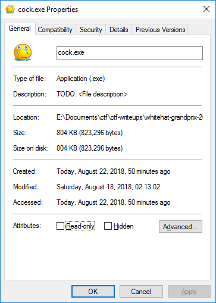
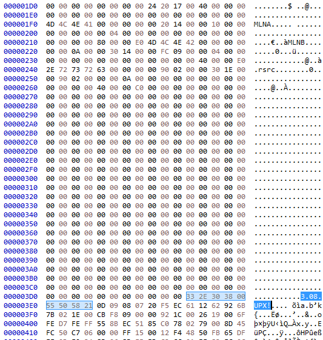
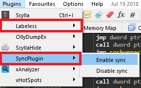

# rev04

**Category**: Reverse

390 Points

11 Solves

**Problem description**:
n/a

**Solved by**: cts, sampriti

---

*Writeup by cts*

This challenge was a very tough multistaged Windows rev. The only thing missing was a remote code stub dongle ;)

The only file we are given is `WH2018.exe`. The first thing to notice is that Windows refuses to even load it, indicating the PE header is damaged. 

## Phase 1: Unpacking


Let's try to load it in IDA anyways.


Ok...maybe not such a great idea. We better put it under [CFF Explorer][1] instead.



Everything seems normal up to this point...DOS and PE header are OK too.


Hold it! If this is a 32-bit code binary, then why is it a PE64 file? It's rare for 32-bit binaries to be compiled into PE64+ (64-bit) binaries. If you disassemble some of the code too, it's clearly 32-bit. So let's fix that:


Also, fixing that makes the program's icon show up, which means we're on the right track! That means the resources directory got parsed correctly.



Moving on, the rest of this Optional Header seems really messed up as well, namely the Entrypoint:


To recover OEP, we need to unfortunately take a look at the actual binary's contents.



Judging from this, it's pretty obviously packed with UPX 3.08, but the UPX0 and UPX1 sections have been renamed to break the unpacker in case we try to decompress it as-is:

```
> upx394w\upx.exe -d "WH2018.exe"
                       Ultimate Packer for eXecutables
                          Copyright (C) 1996 - 2017
UPX 3.94w       Markus Oberhumer, Laszlo Molnar & John Reiser   May 12th 2017


        File size         Ratio      Format      Name
   --------------------   ------   -----------   -----------
upx: WH2018.exe: NotPackedException: not packed by UPX

Unpacked 0 files.
```

(side note: UPX 3.08 is further evidence that the file is 32-bit. UPX 3.08, unlike newer versions, refuses to pack 64-bit bins.)

Let's just fix that up:


Since we know it's UPX, finding the OEP is pretty trivial. Save the file in CFF Explorer and reopen it in IDA (in 32-bit mode). For 32-bit UPX, the decompression stub begins:

```
UPX1:OEP   60                 pusha
UPX1:OEP+1 BE XX XX XX XX     mov     esi, offset dword_XXXXXXXX
UPX1:OEP+6 8D BE XX XX XX XX  lea     edi, [esi-XXXXXXXXh]
```

So searching for this pattern, we can easily find the decryption stub in WH2018.exe:


IDA reports this is at file offset 9FBC0, so to calculate the OEP we take `OEP = FO + BaseOfCode - .text[PointerToRawData] - FileAlignment = 1E28D0`. `.text[PointerToRawData]` and `FileAlignment` are usually 0x200.


Now the entrypoint shows correctly. And we can even run it!


Let's decompress it now.

```
 upx394w\upx.exe -d "cock.exe"
                       Ultimate Packer for eXecutables
                          Copyright (C) 1996 - 2017
UPX 3.94w       Markus Oberhumer, Laszlo Molnar & John Reiser   May 12th 2017


        File size         Ratio      Format      Name
   --------------------   ------   -----------   -----------
   1872384 <-    823296   43.97%    win32/pe     cock.exe

Unpacked 1 file.
```

Nice. Now we can analyze this bin proper!

## Phase 2: Patching

Since it's a AFX/MFC GUI program, it uses event-based programming which can be very annoying to locate the callback functions. Luckily, there's a x64dbg plugin [xHotSpots][2] to locate them:


Nice! This is good. And indeed, when we click the "Check" button in the program, the breakpoint is hit.


This is an indirect jump, so of course we will just step in and then navigate to IDA.



#### Aside: Afx strings
When reversing AFX applications, a constant source of pain is the "CAfxStringMgr" class. It's basically just a smart string factory, except the struct is laid out in a strange way that the compiler emits code using negative struct offsets to reference the header fields.

The structs usually look something like this:

```C
struct CAfxStringMgr::vtable
{
  int (__stdcall *mystery0)(CAfxStringMgr *this, int);
  int (__stdcall *mystery1)(CAfxStringMgr *this);
  int (__stdcall *CAfxStringMgr::vmt1)(CAfxStringMgr *this, int, int);
  AfxString *(__thiscall *CAfxStringMgr::GetNewString)(CAfxStringMgr *this);
  int (__cdecl *mystery3)();
};
struct CAfxStringMgr
{
  CAfxStringMgr::vtable *pvft;
  AfxString nextString;
};
struct AfxString
{
  AfxString::vtable *vft;
  int len;
  int pad1;
  int refCount;
  AfxStringData s;
};
struct AfxStringData
{
  char s[];
};
struct AfxString::vtable
{
  void (__thiscall *dtor)(AfxString *this);
};
```

Using a plugin called [HexRaysPyTools][3] you can make the negative offset code look nice, but since I was in a hurry to sleep I didn't bother this time. I've also included a ripped C++ source code for the headers too.

Also, since this is Win32, there's the constant headache of Unicode vs. Multibyte vs. ASCII strings. The key fact to understand is that Unicode strings are WCHAR (16bit) strings, so each character is actually 2 bytes wide.

## Check 1: "Check" button
Anyways, back to the challenge. After decompiling and some cleanup, the code for the "Check" button callback looks like:

```C
// very bigdick func
void __thiscall sub_408860(BigDick *this)
{
  void *v2; // eax
  int v3; // eax
  int v4; // ebp
  void *v5; // eax
  int v6; // eax
  int v7; // edi
  const WCHAR *cmdline; // eax
  LPWSTR *argv; // esi
  volatile signed __int32 *v10; // eax
  int i; // edi
  LPWSTR argv2_strend; // eax
  int argv_strstart; // edx
  WCHAR v14; // cx
  int v15; // eax
  signed __int32 v16; // ecx
  bool v17; // zf
  bool v18; // sf
  LPWSTR v19; // ecx
  _WORD *v20; // edx
  WCHAR v21; // ax
  void *strMgr; // eax
  int *wowie; // eax
  int v24; // eax
  char *startOfStr; // esi
  WCHAR *pChar; // eax
  WCHAR curCharVal; // cx
  int requiredSize; // eax
  signed int idx; // eax
  signed int idx_1; // eax
  int v31; // eax
  signed __int32 v32; // ecx
  bool v33; // zf
  bool v34; // sf
  signed __int32 v35; // edx
  signed __int32 v36; // edx
  CWnd *v37; // ecx
  int v38; // [esp+14h] [ebp-5C0h]
  int v39; // [esp+18h] [ebp-5BCh]
  char *fuckingReturnVal; // [esp+1Ch] [ebp-5B8h]
  int pNumArgs; // [esp+20h] [ebp-5B4h]
  int wowieSrc; // [esp+24h] [ebp-5B0h]
  BigDick *v43; // [esp+28h] [ebp-5ACh]
  WCHAR checkedAgainst[35]; // [esp+2Ch] [ebp-5A8h]
  CHAR checkedAgainstSrc; // [esp+A4h] [ebp-530h]
  char v46[259]; // [esp+A5h] [ebp-52Fh]
  WCHAR srcsrc; // [esp+1A8h] [ebp-42Ch]
  char v48[518]; // [esp+1AAh] [ebp-42Ah]
  WCHAR Filename; // [esp+3B0h] [ebp-224h]
  char v50[528]; // [esp+3B2h] [ebp-222h]
  int v51; // [esp+5D0h] [ebp-4h]

  v43 = this;
  v2 = CAfxStringMgr::getInst__();
  if ( !v2 )
    throwException(-2147467259);
  v3 = (*(int (__thiscall **)(void *))(*(_DWORD *)v2 + 12))(v2);
  v4 = v3 + 16;
  v38 = v3 + 16;
  v51 = 0;
  v5 = CAfxStringMgr::getInst__();
  if ( !v5 )
    throwException(-2147467259);
  v6 = (*(int (__thiscall **)(void *))(*(_DWORD *)v5 + 12))(v5);
  v7 = v6 + 16;
  v39 = v6 + 16;
  LOBYTE(v51) = 1;
  Filename = 0;
  memset(v50, 0, 0x210u);
  GetModuleFileNameW(0, &Filename, 0x104u);
  cmdline = GetCommandLineW();
  argv = CommandLineToArgvW(cmdline, &pNumArgs);
  if ( pNumArgs != 5 )
  {
    LOBYTE(v51) = 0;
    if ( _InterlockedDecrement((volatile signed __int32 *)(v7 - 16 + 12)) <= 0 )
      (*(void (__stdcall **)(int))(**(_DWORD **)(v7 - 16) + 4))(v7 - 16);
    v51 = -1;
    v10 = (volatile signed __int32 *)(v4 - 16);
wrongLen:
    if ( _InterlockedDecrement(v10 + 3) <= 0 )
      (*(void (__stdcall **)(volatile signed __int32 *))(**(_DWORD **)v10 + 4))(v10);
    return;
  }
  i = 0;
  do                                            // print args? lol
    OutputDebugStringW(argv[i++]);
  while ( i < pNumArgs );
  memset(this->field_78, 0, 0x208u);
  memset(this->field_280, 0, 0x208u);
  memset(this->field_488, 0, 0x208u);
  memset(this->field_690, 0, 0x208u);
  OutputDebugStringW(argv[2]);
  argv2_strend = argv[2];
  argv_strstart = (int)(argv2_strend + 1);
  do                                            // strlen
  {
    v14 = *argv2_strend;
    ++argv2_strend;
  }
  while ( v14 );
  if ( ((signed int)argv2_strend - argv_strstart) >> 1 != 35 )// strlen/2 == 35, but keep in mind it's a wide char
  {
    LOBYTE(v51) = 0;
    v15 = v39 - 16;
    v16 = _InterlockedDecrement((volatile signed __int32 *)(v39 - 16 + 12));
    v17 = v16 == 0;
    v18 = v16 < 0;
wrongPW:
    if ( v18 || v17 )
      (*(void (__stdcall **)(int))(**(_DWORD **)v15 + 4))(v15);
    v51 = -1;
    v10 = (volatile signed __int32 *)(v38 - 16);
    goto wrongLen;
  }
  CreateMutexW(0, 1, L"kernel32.dll");
  if ( GetLastError() == ERROR_ALREADY_EXISTS )
    ExitProcess(0);
  v19 = argv[2];
  v20 = this->field_280;
  do
  {
    v21 = *v19;
    *v20 = *v19;
    ++v19;
    ++v20;
  }
  while ( v21 );
  strMgr = CAfxStringMgr::getInst__();
  if ( !strMgr )
    throwException(-2147467259);
  fuckingReturnVal = (char *)((*(int (__thiscall **)(void *))(*(_DWORD *)strMgr + 12))(strMgr) + 16);
  LOBYTE(v51) = 2;
  checkedAgainstSrc = 0;
  memset(v46, 0, 0x103u);
  srcsrc = 0;
  memset(v48, 0, 0x206u);
  initBigDickStr(&fuckingReturnVal);
  wowie = getWowie(&wowieSrc, argv[2]);
  LOBYTE(v51) = 3;
  strcpyProbablyidklol(&fuckingReturnVal, (void **)wowie);
  LOBYTE(v51) = 2;
  v24 = wowieSrc - 16;
  if ( _InterlockedDecrement((volatile signed __int32 *)(wowieSrc - 16 + 12)) <= 0 )
    (*(void (__stdcall **)(int))(**(_DWORD **)v24 + 4))(v24);
  startOfStr = fuckingReturnVal;
  if ( *((_DWORD *)fuckingReturnVal - 1) > 1 )
  {
    initBigDickStr2(&fuckingReturnVal, *((_DWORD *)fuckingReturnVal - 3));
    startOfStr = fuckingReturnVal;
  }
  pChar = (WCHAR *)startOfStr;
  do                                            // fucking strcpy(srcsrc, pChar)
  {
    curCharVal = *pChar;
    *(WCHAR *)((char *)pChar + (char *)&srcsrc - startOfStr) = *pChar;
    ++pChar;
  }
  while ( curCharVal );
  requiredSize = WideCharToMultiByte(0, 0, &srcsrc, -1, 0, 0, 0, 0);
  WideCharToMultiByte(0, 0, &srcsrc, -1, &checkedAgainstSrc, requiredSize, 0, 0);
  checkedAgainst[0] = 0;
  memset(&checkedAgainst[1], 0, 0x76u);
  idx = 0;
  do                                            // srcpy(checkedAgainst, checkedAgainstSrc)
  {
    checkedAgainst[idx] = *(&checkedAgainstSrc + idx);
    ++idx;
  }
  while ( idx < 50 );
  idx_1 = 0;
  do                                            // xor against 0x66
    checkedAgainst[idx_1++] ^= 0x66u;
  while ( idx_1 < 50 );
  if ( checkedAgainst[0] != '_' )
  {
    v31 = (int)(startOfStr - 16);
    LOBYTE(v51) = 1;
    v32 = _InterlockedDecrement((volatile signed __int32 *)startOfStr - 1);
    v33 = v32 == 0;
    v34 = v32 < 0;
wrongPw2:
    if ( v34 || v33 )
      (*(void (__stdcall **)(int))(**(_DWORD **)v31 + 4))(v31);
    LOBYTE(v51) = 0;
    v15 = v39 - 16;
    v35 = _InterlockedDecrement((volatile signed __int32 *)(v39 - 16 + 12));
    v17 = v35 == 0;
    v18 = v35 < 0;
    goto wrongPW;
  }
  if ( checkedAgainst[1] != '$'
    || checkedAgainst[2] != '^'
    || checkedAgainst[3] != 'W'
    || checkedAgainst[4] != '_'
    || checkedAgainst[5] != '#'
    || checkedAgainst[6] != '%'
    || checkedAgainst[7] != 'W' )
  {
    v31 = (int)(startOfStr - 16);
    LOBYTE(v51) = 1;
    v36 = _InterlockedDecrement((volatile signed __int32 *)startOfStr - 1);
    v33 = v36 == 0;
    v34 = v36 < 0;
    goto wrongPw2;
  }
  if ( checkedAgainst[8] == 'S'
    && checkedAgainst[9] == '$'
    && checkedAgainst[10] == 'R'
    && checkedAgainst[11] == '#'
    && checkedAgainst[12] == '$'
    && checkedAgainst[13] == '^'
    && checkedAgainst[14] == '\''
    && checkedAgainst[15] == 'W'
    && checkedAgainst[16] == '%'
    && checkedAgainst[17] == 'S'
    && checkedAgainst[18] == '%'
    && checkedAgainst[19] == '\''
    && checkedAgainst[20] == 'T'
    && checkedAgainst[21] == 'U'
    && checkedAgainst[22] == '_'
    && checkedAgainst[23] == 'V'
    && checkedAgainst[24] == '\''
    && checkedAgainst[25] == '#'
    && checkedAgainst[26] == 'W'
    && checkedAgainst[27] == 'R'
    && checkedAgainst[28] == '#'
    && checkedAgainst[29] == 'T'
    && checkedAgainst[30] == '^'
    && checkedAgainst[31] == '_'
    && checkedAgainst[32] == '^'
    && checkedAgainst[33] == 'Q'
    && checkedAgainst[34] == '\'' )             // 9B819EC15B4EB8A1C5CA2390AE14E28987A
  {
    v37 = (CWnd *)&v43[1].gap_0[20];
    *(_DWORD *)v43[1].gap_0 = 1;
    CWnd::EnableWindow(v37, 1);
  }
  fuckingString::dtor(&fuckingReturnVal);
  fuckingString::dtor(&v39);
  fuckingString::dtor(&v38);
}
```

In other words, it's checking if the program is passed 4 arguments (not counting argv\[0\]) and the second one must be `9B819EC15B4EB8A1C5CA2390AE14E28987A`. There are really two approaches here: you can either patch the check and bypass it or reverse the argument's required value. I chose the second option since it could be used later for printing the flag, etc.


When this new commandline is passed, the "Check" button enables the "Scan" button. The two textboxes aren't used by "Check".

## Check 2: "Scan button"

We now go back to our old magic breakpoint earlier, but now triggering it with the "Scan" button. Stepping in, we meet this *monster* of a function:

```C
void __thiscall massiveFUCKingCock(CWnd *this)
{
  CWnd *v1; // esi
  void *v2; // eax
  char *v3; // eax
  signed __int32 v4; // ecx
  bool v5; // zf
  bool v6; // sf
  void *afxStr; // eax
  char *part2_; // eax
  int *part2__wowied; // eax
  char *v10; // eax
  char *largSrc; // edi
  WCHAR *pChar; // eax
  WCHAR v13; // cx
  int neededLen; // eax
  unsigned int lenOfStr; // ecx
  unsigned int v16; // edx
  char *topboxBase64d; // esi
  unsigned int v18; // ecx
  unsigned int v19; // edx
  signed __int32 v20; // ebp
  signed __int32 v21; // ebp
  signed int v22; // ecx
  signed int i; // eax
  signed int idx_1; // eax
  signed int idx_2; // eax
  CWnd *v26; // esi
  char *topBoxxx; // eax
  const CHAR *motherFuckinNewBof; // esi
  signed int idx; // eax
  int v30; // eax
  char *fuckingAppeded; // eax
  char *fuckingAppended2; // eax
  char *msgTxt; // eax
  char *bototmBox; // [esp+14h] [ebp-A1Ch]
  char *pstr; // [esp+18h] [ebp-A18h]
  char *biglyThonkk; // [esp+20h] [ebp-A10h]
  int topBox; // [esp+24h] [ebp-A0Ch]
  int congratulationFlagBuff[21]; // [esp+2Ch] [ebp-A04h]
  int checkedBuf[200]; // [esp+80h] [ebp-9B0h]
  char topboxHashChecked[32]; // [esp+3A0h] [ebp-690h]
  __int16 hashofTopbox; // [esp+3C4h] [ebp-66Ch]
  char v44; // [esp+3C6h] [ebp-66Ah]
  CHAR largCockMultibyte; // [esp+408h] [ebp-628h]
  char v46; // [esp+409h] [ebp-627h]
  BYTE pbData; // [esp+50Ch] [ebp-524h]
  char v48; // [esp+50Dh] [ebp-523h]
  WCHAR largCock; // [esp+610h] [ebp-420h]
  char v50; // [esp+612h] [ebp-41Eh]
  WCHAR Caption; // [esp+818h] [ebp-218h]
  char v52; // [esp+81Ah] [ebp-216h]
  int v53; // [esp+A2Ch] [ebp-4h]

  v1 = this;
  v2 = CAfxStringMgr::getInst__();
  if ( v2 == 0 )
    throwException(-2147467259);
  bototmBox = (char *)((*(int (__thiscall **)(void *))(*(_DWORD *)v2 + 12))(v2) + 16);
  v53 = 0;
  CWnd::GetWindowTextW((int)v1 + 2220, (int)&bototmBox);
  if ( *((_DWORD *)bototmBox - 3) != 72 || isDebuggerPresent )// it must be 72 long
  {
    v3 = bototmBox - 16;
    v53 = -1;
    v4 = _InterlockedDecrement((volatile signed __int32 *)bototmBox - 1);
    v5 = v4 == 0;
    v6 = v4 < 0;
    goto faillll;
  }
  afxStr = CAfxStringMgr::getInst__();
  if ( afxStr == 0 )
    throwException(-2147467259);
  pstr = (char *)((*(int (__thiscall **)(void *))(*(_DWORD *)afxStr + 12))(afxStr) + 16);
  LOBYTE(v53) = 1;
  largCockMultibyte = 0;
  memset(&v46, 0, 0x103u);
  largCock = 0;
  memset(&v50, 0, 0x206u);
  initBigDickStr(&pstr);
  part2_ = bototmBox;
  if ( *((_DWORD *)bototmBox - 1) > 1 )
  {
    initBigDickStr2(&bototmBox, *((_DWORD *)bototmBox - 3));
    part2_ = bototmBox;
  }
  part2__wowied = getWowie((int *)&biglyThonkk, (const unsigned __int16 *)part2_);
  LOBYTE(v53) = 2;
  strcpyProbablyidklol(&pstr, (void **)part2__wowied);
  LOBYTE(v53) = 1;
  v10 = biglyThonkk - 16;
  if ( _InterlockedDecrement((volatile signed __int32 *)biglyThonkk - 1) <= 0 )
    (*(void (__stdcall **)(char *))(**(_DWORD **)v10 + 4))(v10);
  largSrc = pstr;
  if ( *((_DWORD *)pstr - 1) > 1 )
  {
    initBigDickStr2(&pstr, *((_DWORD *)pstr - 3));
    largSrc = pstr;
  }
  pChar = (WCHAR *)largSrc;
  do
  {                                             // strcpy(largCock, largSrc)
    v13 = *pChar;
    *(WCHAR *)((char *)pChar + (char *)&largCock - largSrc) = *pChar;
    ++pChar;
  }
  while ( v13 );
  neededLen = WideCharToMultiByte(0, 0, &largCock, -1, 0, 0, 0, 0);
  WideCharToMultiByte(0, 0, &largCock, -1, &largCockMultibyte, neededLen, 0, 0);
  lenOfStr = strlen(&largCockMultibyte);
  v16 = 3 * (lenOfStr / 3);
  if ( lenOfStr != v16 )
    lenOfStr = v16 + 3;
  topboxBase64d = (char *)malloc(8 * lenOfStr / 6 + 1);
  v18 = strlen(&largCockMultibyte);
  v19 = 3 * (v18 / 3);
  if ( v18 != v19 )
    v18 = v19 + 3;
  malloc(8 * v18 / 6 + 1);
  if ( !topboxBase64d )                         // check alloc success
  {
    LOBYTE(v53) = 0;
    if ( _InterlockedDecrement((volatile signed __int32 *)largSrc - 1) <= 0 )
      (*(void (__stdcall **)(char *))(**((_DWORD **)largSrc - 4) + 4))(largSrc - 16);
    goto fail;
  }
  base64ProbablyLol(topboxBase64d, (int)&largCockMultibyte, strlen(&largCockMultibyte));
  if ( strlen(topboxBase64d) != 96 )            // len must = 96
  {
    LOBYTE(v53) = 0;
    if ( _InterlockedDecrement((volatile signed __int32 *)largSrc - 1) <= 0 )
    {
      (*(void (__stdcall **)(char *))(**((_DWORD **)largSrc - 4) + 4))(largSrc - 16);
      v53 = -1;
      v3 = bototmBox - 16;
      v21 = _InterlockedDecrement((volatile signed __int32 *)bototmBox - 1);
      v5 = v21 == 0;
      v6 = v21 < 0;
faillll:
      if ( v6 || v5 )
        (*(void (__stdcall **)(char *))(**(_DWORD **)v3 + 4))(v3);
      return;
    }
fail:
    v53 = -1;
    v3 = bototmBox - 16;
    v20 = _InterlockedDecrement((volatile signed __int32 *)bototmBox - 1);
    v5 = v20 == 0;
    v6 = v20 < 0;
    goto faillll;
  }
  checkedBuf[0] = 0;
  memset(&checkedBuf[1], 0, 0x31Cu);            // really its 0x320 since we already did 4
  v22 = strlen(topboxBase64d);
  for ( i = 0; i < v22; ++i )
    checkedBuf[i] = topboxBase64d[i];
  idx_1 = 0;
  do
  {
    topboxBase64d[idx_1] ^= 0x60u;              // xor with 0x60
    ++idx_1;
  }
  while ( idx_1 < 96 );
  if ( CheckFunc1(checkedBuf) && CheckFunc2(&checkedBuf[32]) && Check3(&checkedBuf[64]) )// fucK
  {                                             // check3 = MjY4RTI1QTE0RkIxRENDOTIzODcwQzA1 = 268E25A14FB1DCC923870C05
    idx_2 = 0;                                  // check1 = QUQ5OThENEYxQjQxMEY4Q0VCNEFBNzRF = AD998D4F1B410F8CEB4AA74E
                                                // check2 = MTQ0RDIxOUVGNUI5NDU5REE4RTFEMDNC = 144D219EF5B9459DA8E1D03B
    do
    {                                           // undo the xor???
      topboxBase64d[idx_2] ^= 0x60u;
      ++idx_2;
    }
    while ( idx_2 < 96 );
    v26 = this;
    *((_DWORD *)this + 551) = 1;
    maekNewStrang(&topBox);
    LOBYTE(v53) = 3;
    CWnd::GetWindowTextW((int)v26 + 2304, (int)&topBox);
    if ( *(_DWORD *)(topBox - 12) == 8 && !NtQueryInformationProcess )// len = 8
    {
      pbData = 0;
      memset(&v48, 0, 0x103u);
      hashofTopbox = 0;
      memset(&v44, 0, 0x40u);
      topboxHashChecked[0] = 0;                 // init new afx string
      *(_DWORD *)&topboxHashChecked[1] = 0;
      *(_DWORD *)&topboxHashChecked[5] = 0;
      *(_DWORD *)&topboxHashChecked[9] = 0;
      *(_DWORD *)&topboxHashChecked[13] = 0;
      *(_DWORD *)&topboxHashChecked[17] = 0;
      *(_DWORD *)&topboxHashChecked[21] = 0;
      *(_DWORD *)&topboxHashChecked[25] = 0;
      *(_DWORD *)&topboxHashChecked[29] = 0;
      topBoxxx = thonk((char **)&topBox);
      convertStringType((CHAR *)&pbData, (const WCHAR *)topBoxxx);
      md5hashShitGetDigest(&pbData, &hashofTopbox);
      convertStringType(topboxHashChecked, (const WCHAR *)&hashofTopbox);
      if ( !checkDaFlagggsHash((int)topboxHashChecked) )// 3AB47284CF7E260541D810BEB54D3405 -> whitehat
        ExitProcess('\0');
      congratulationFlagBuff[0] = 'C';
      congratulationFlagBuff[1] = 'O';
      congratulationFlagBuff[2] = 'N';
      congratulationFlagBuff[3] = 'G';
      congratulationFlagBuff[4] = 'R';
      congratulationFlagBuff[5] = 'A';
      congratulationFlagBuff[6] = 'T';
      congratulationFlagBuff[7] = 'U';
      congratulationFlagBuff[8] = 'L';
      congratulationFlagBuff[9] = 'A';
      congratulationFlagBuff[10] = 'T';
      congratulationFlagBuff[11] = 'I';
      congratulationFlagBuff[12] = 'O';
      congratulationFlagBuff[13] = 'N';
      congratulationFlagBuff[14] = '\0';
      congratulationFlagBuff[15] = '\r';
      congratulationFlagBuff[16] = '\0';
      congratulationFlagBuff[17] = 'F';
      congratulationFlagBuff[18] = 'L';
      congratulationFlagBuff[19] = 'A';
      congratulationFlagBuff[20] = 'G';
      motherFuckinNewBof = (const CHAR *)operator new[](0x16u);
      Caption = 0;
      memset(&v52, '\0', 0x206u);
      if ( motherFuckinNewBof )
      {
        idx = 0;
        do
        {
          motherFuckinNewBof[idx] = LOBYTE(congratulationFlagBuff[idx]) + 32;
          ++idx;
        }
        while ( idx < 21 );
        *((_BYTE *)motherFuckinNewBof + 21) = '\0';
        v30 = MultiByteToWideChar('\0', '\0', motherFuckinNewBof, -1, (LPWSTR)'\0', '\0');
        MultiByteToWideChar('\0', '\0', motherFuckinNewBof, -1, &Caption, v30);
        maekNewStrang(&biglyThonkk);
        LOBYTE(v53) = 4;
        if ( !checkDebugregs() )
        {
          initBigDickStr(&biglyThonkk);
          strcattt((int *)&biglyThonkk, (wchar_t *)this + 320);
          strcattt((int *)&biglyThonkk, L"+");
          fuckingAppeded = thonk((char **)&topBox);
          strcattt((int *)&biglyThonkk, (wchar_t *)fuckingAppeded);
          strcattt((int *)&biglyThonkk, L"+");
          fuckingAppended2 = thonk(&bototmBox);
          strcattt((int *)&biglyThonkk, (wchar_t *)fuckingAppended2);
          msgTxt = thonk(&biglyThonkk);
          CWnd::MessageBoxW(this, (LPCWSTR)msgTxt, &Caption, '\0');
          ExitProcess('\0');
        }
        fuckingString::dtor(&biglyThonkk);
      }
    }
    fuckingString::dtor(&topBox);
  }
  fuckingString::dtor(&pstr);
  fuckingString::dtor(&bototmBox);
}
```

[1]: https://ntcore.com/?page_id=388
[2]: https://github.com/ThunderCls/xHotSpots
[3]: https://github.com/igogo-x86/HexRaysPyTools
